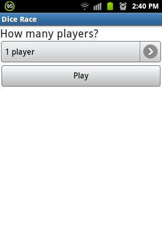
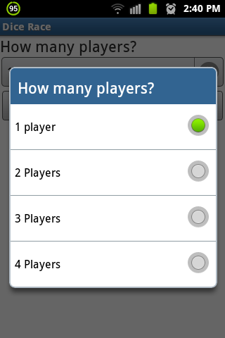
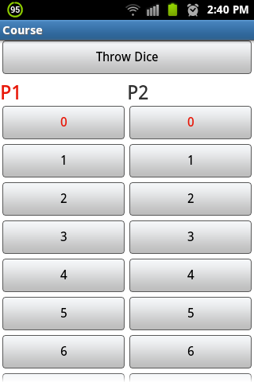
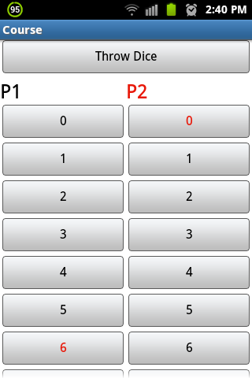
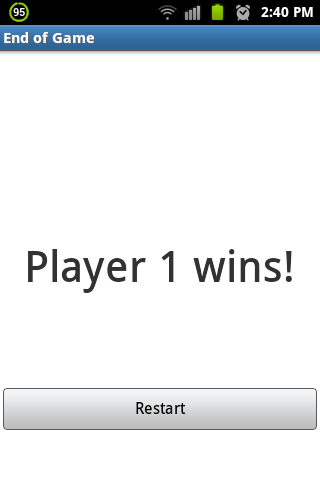

# Dice Race

Aplicación que simula un minijuego de carreras, donde los jugadores avanzan tantos pasos como indica un dado, reutiliza el código de la aplicación _Dado_.

Permite hasta 4 jugadores en una pista de 10 pasos, pero es expandible hasta 9 jugadores en una pista 100 pasos.

## Aspectos técnicos
Todas las cadenas de texto usadas son extraídas del archivo `strings.xml`, o que evita advertencias del tipo _"i18n string hard coded"_.

Los modos de juego (número de jugadores) se generan a partir de un arreglo de cadenas de texto.

Por motivos de visualización, la pantalla de la pista tiene un máximo 4 jugadores, sin embargo, el código que genera la pista es capaz de generar y visualizar pistas para hasta 9 jugadores y hasta 100 pasos.

Cuando se elige la modalidad de un solo jugador, el valor de avance del _cpu_ se genera llamando el activity del dado como si fuera una clase y ejecutando su método de generar número aleatorio.

La interfaz de la pista se genera basada en un `TableLayout` en el cual se generan dinámicamente las filas y columnas mediante código, en oposición a generarlas desde el xml.

De acuerdo al jugador en turno, la etiqueta indicadora (P1, P2,..., P_n_) va cambiando de color, al igual que el botón que indica la posición del avance.

## Screenshots

## TODO

- Mejorar la visualización general de la aplicación
- Corregir el bug al retroceder después de haber dado reset.